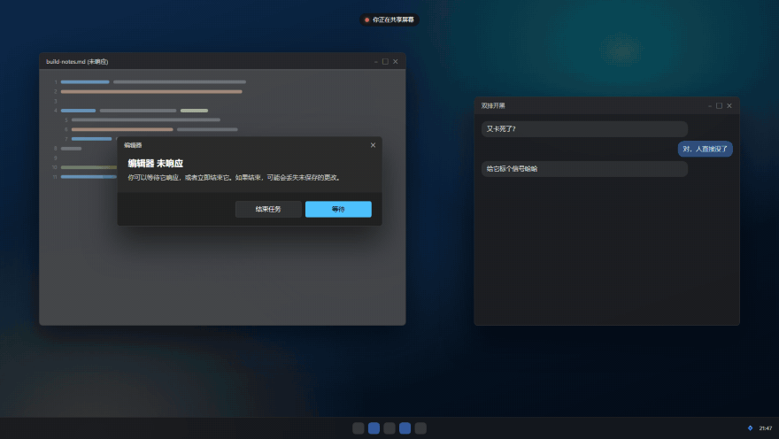
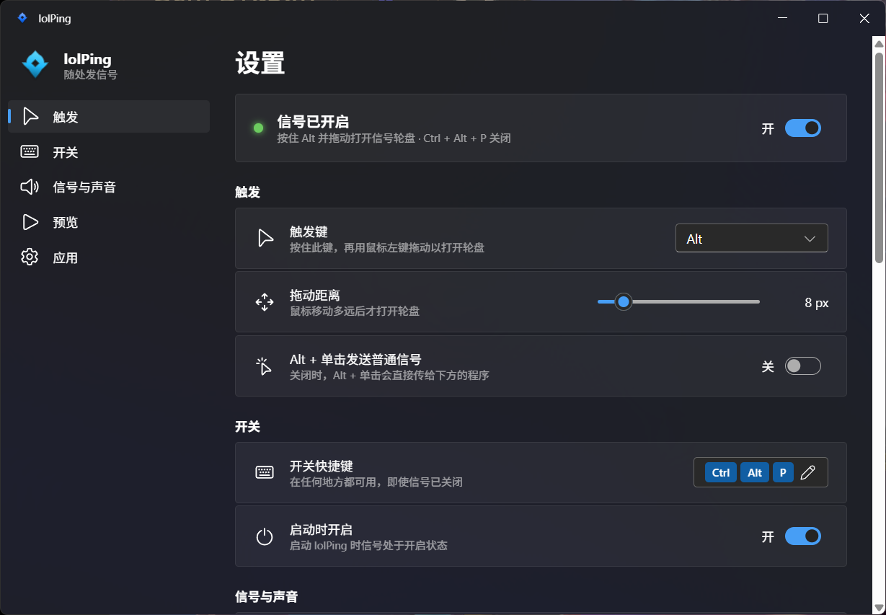

<h1 align="center"><br>lolPing</h1>

<p align="center">
  <a href="README.md">English</a> | 简体中文
</p>

<p align="center">
  把英雄联盟的信号轮盘搬到整个 Windows 桌面。<br>
  按住 <b>Alt</b> 拖动，在想要的信号上松开：动画弹出、音效响起，任何程序之上、任何显示器上都可以。
</p>

<p align="center">
  <a href="https://github.com/danruimeng/lolPing/releases/latest"><b>下载 Windows 版</b></a>
</p>

<p align="center">
  <a href="https://github.com/danruimeng/lolPing/actions/workflows/ci.yml"></a>
  <a href="https://github.com/danruimeng/lolPing/releases/latest"></a>
  <a href="LICENSE"></a>
</p>

<p align="center"></p>

信号会出现在全屏录制/共享画面里，所以在 Discord 或 OBS 上看你直播的朋友也能看到。lolPing 只是一个桌面小玩具：它不会读取、修改或注入英雄联盟本身。

## 安装

1. 从[最新版本](https://github.com/danruimeng/lolPing/releases/latest)下载 `lolPing-Setup-<版本号>.exe`。
2. 运行安装程序。安装程序没有代码签名，Windows SmartScreen 可能会提示“Windows 已保护你的电脑”：点击**更多信息**，再点**仍要运行**。
3. lolPing 会打开设置窗口并常驻系统托盘。按住 Alt 在任意位置拖动即可发信号。

lolPing 面向 64 位 Windows 11。Windows 10 也许可以用，但没有测试过。

## 使用

| 想要 | 操作 |
| --- | --- |
| 发信号 | 按住 **Alt** 拖动，在某个扇区上松开 |
| 取消 | 在中心松开、点右键，或按 **Esc** |
| 暂停 / 恢复 | **Ctrl + Alt + P** |
| 打开设置 | 单击托盘图标 |
| 退出，或重启输入助手 | 右键托盘图标 |

轮盘从正上方开始顺时针依次是：危险（撤退）、推进、正在赶来、全力进攻（All In）、请求协助、需要视野、敌人消失、敌方视野。

## 设置



- **触发键：** Alt、Ctrl、Shift、Win、Caps Lock、鼠标侧键 4/5，或任意其他按键。开启信号时，自定义按键在其他程序里不会再输入字符。
- **Alt + 单击发送普通信号：** 默认关闭，这样平时的 Alt + 单击快捷操作不受影响。
- **开关快捷键：** 必须包含 Ctrl、Alt 或 Win。
- **信号与声音：** 大小、持续时间、音量、静音、轮盘提示音，并可预览每一种信号。
- **开机启动：** 启动后隐藏在托盘中。
- **语言：** 默认跟随 Windows 显示语言，也可以手动选择 English 或简体中文。

设置保存在 `%APPDATA%\lolPing\settings.json`。

## 已知限制

- 在以管理员身份运行的窗口（例如任务管理器）上无法打开轮盘，因为 Windows 不会把这些窗口的输入交给普通程序。
- 独占全屏的游戏会盖住信号层。
- 只共享单个窗口时看不到信号，请改为共享整个屏幕。

## 从源码构建

需要 Windows 11、Node 22.12 或更新版本，以及安装了“使用 C++ 的桌面开发”工作负载的 Visual Studio 2022 或更新版本。

```bash
npm install
npx install-electron
npm run build:helper
npm run dev
```

`npx install-electron` 会下载 `npm run dev` 所需的 Electron 程序。

| 命令 | 作用 |
| --- | --- |
| `npm test` | TypeScript 测试，包括以 `--simulate` 模式运行真实输入助手的协议测试 |
| `npm run test:helper` | 构建输入助手并运行 C++ 测试 |
| `npm run typecheck` | 全量类型检查 |
| `npm run dist` | 在 `release/` 中生成安装程序 |
| `npm run dev:site` | 启动轮盘的浏览器演示页（`site/`） |
| `npm run media` | 用演示页重新录制 `docs/media/demo.gif` 和 `docs/media/og.png`（需要 ffmpeg） |

### 发布新版本

修改 `package.json` 中的 `version` 并提交，然后推送对应的标签，例如 `v0.2.0`。Release 工作流会自动构建安装程序并附加到 GitHub Release。

## 工作原理

- **输入：** [`native/hook-helper`](native/hook-helper) 是一个小型 C++ 进程，负责底层鼠标和键盘钩子。它会吞掉 Alt + 拖动，使下面的程序完全收不到，并通过 stdin/stdout 以 JSON 行与 Electron 通信。
- **显示：** Electron 在每个显示器上用一个透明、可点击穿透、始终置顶的窗口绘制轮盘和信号（[`src/renderer/overlay`](src/renderer/overlay)），并用 Web Audio 播放音效。
- **设置：** 采用 Fluent UI 与 Mica 材质的窗口（[`src/renderer/settings`](src/renderer/settings)）。
- **演示页：** [`site`](site) 在浏览器中运行同一套信号层代码，用一个小的输入适配层代替输入助手。README 里的 GIF 就是用它录制的。
- **设计文档：** [docs/design.md](docs/design.md)（英文）介绍了通信协议、输入状态机和多显示器坐标换算。

## 信号素材

`assets/textures` 中的图标和 `assets/sounds` 中的音效提取自本地安装的英雄联盟。游戏更新后如何重新提取，请见 [`tools/extract-assets`](tools/extract-assets)。

## 许可证

代码采用 [MIT 许可证](LICENSE)。信号图标和音效版权归 Riot Games 所有，不在该许可证范围内。如果你代表 Riot Games 并希望移除相关内容，请提交 issue。

lolPing isn't endorsed by Riot Games and doesn't reflect the views or opinions of Riot Games or anyone officially involved in producing or managing Riot Games properties. Riot Games, and all associated properties are trademarks or registered trademarks of Riot Games, Inc.
